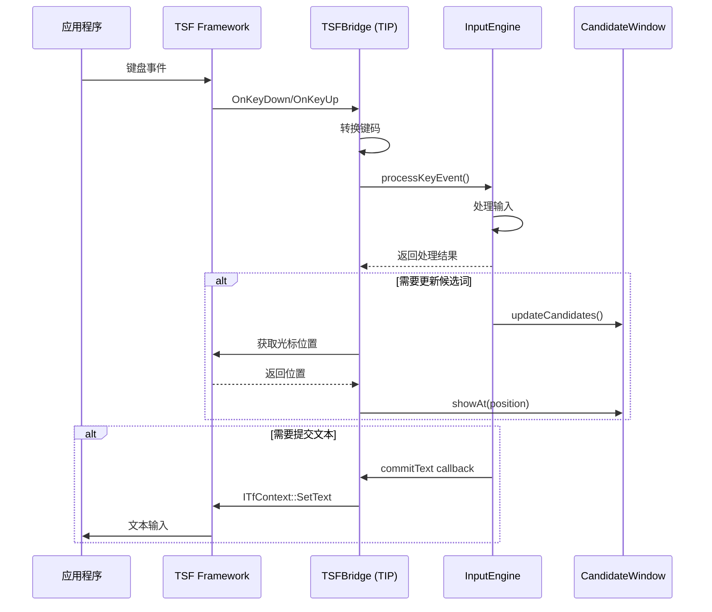

# Design Document: Windows TSF Integration

## Overview

本设计文档描述素言输入法 Windows 平台的 TSF (Text Services Framework) 集成实现。设计目标是：

1. 实现完整的 TSF 接口，使输入法能够在 Windows 系统中正常工作
2. 复用现有的跨平台核心层（InputEngine、RimeWrapper）和 UI 层（CandidateWindow）
3. 保持与 macOS 版本一致的用户体验

### 架构概览

```
┌─────────────────────────────────────────────────────────────┐
│                     Windows 应用程序                          │
└─────────────────────────────────────────────────────────────┘
                              ↑↓ TSF 接口
┌─────────────────────────────────────────────────────────────┐
│                      TSF Framework                           │
│  ┌─────────────┐  ┌─────────────┐  ┌─────────────────────┐  │
│  │ ITfThreadMgr│  │ ITfContext  │  │ ITfContextView      │  │
│  └─────────────┘  └─────────────┘  └─────────────────────┘  │
└─────────────────────────────────────────────────────────────┘
                              ↑↓
┌─────────────────────────────────────────────────────────────┐
│                    Platform Layer (Windows)                  │
│  ┌─────────────────────────────────────────────────────┐    │
│  │                    TSFBridge                         │    │
│  │  - ITfTextInputProcessor                            │    │
│  │  - ITfKeyEventSink                                  │    │
│  │  - ITfCompositionSink                               │    │
│  │  - ITfDisplayAttributeProvider                      │    │
│  └─────────────────────────────────────────────────────┘    │
│  ┌─────────────────────────────────────────────────────┐    │
│  │                  WindowsBridge                       │    │
│  │  - IPlatformBridge 实现                              │    │
│  │  - 文本提交、光标位置、Preedit 管理                    │    │
│  └─────────────────────────────────────────────────────┘    │
│  ┌─────────────────────────────────────────────────────┐    │
│  │                   TrayManager                        │    │
│  │  - 系统托盘图标                                       │    │
│  │  - 右键菜单                                          │    │
│  └─────────────────────────────────────────────────────┘    │
└─────────────────────────────────────────────────────────────┘
                              ↑↓
┌─────────────────────────────────────────────────────────────┐
│                      Core Layer (跨平台)                     │
│  ┌─────────────┐  ┌─────────────┐  ┌─────────────────────┐  │
│  │ InputEngine │  │ RimeWrapper │  │ FrequencyManager    │  │
│  └─────────────┘  └─────────────┘  └─────────────────────┘  │
└─────────────────────────────────────────────────────────────┘
                              ↑↓
┌─────────────────────────────────────────────────────────────┐
│                       UI Layer (Qt 跨平台)                   │
│  ┌─────────────┐  ┌─────────────┐  ┌─────────────────────┐  │
│  │CandidateWin │  │ThemeManager │  │ LayoutManager       │  │
│  └─────────────┘  └─────────────┘  └─────────────────────┘  │
└─────────────────────────────────────────────────────────────┘
```

## Architecture

### TSF 框架集成模型

TSF 是 Windows 的现代输入法框架，取代了旧的 IMM (Input Method Manager)。TSF 基于 COM 技术，输入法需要实现一系列 COM 接口。

#### TSF 核心概念

1. **Text Input Processor (TIP)**: 输入法的核心组件，实现 `ITfTextInputProcessor`
2. **Thread Manager**: 管理输入法的生命周期，通过 `ITfThreadMgr` 访问
3. **Document Manager**: 管理文档上下文，通过 `ITfDocumentMgr` 访问
4. **Context**: 表示一个输入上下文，通过 `ITfContext` 访问
5. **Composition**: 表示正在进行的输入组合

#### TSF 事件流



### 组件职责划分

| 组件 | 职责 | 对应 macOS |
|------|------|-----------|
| TSFBridge | TSF 接口实现、键盘事件处理、COM 注册 | IMKBridge |
| WindowsBridge | IPlatformBridge 实现、文本提交、光标获取 | MacOSBridge |
| TrayManager | 系统托盘图标和菜单 | StatusBarManager |
| main.cpp | 程序入口、初始化流程 | main.mm |

## Components and Interfaces

### TSFBridge 类

TSFBridge 是 TSF 框架的核心桥接类，实现所有必需的 COM 接口。

```cpp
// TSFBridge.h
#pragma once

#include <windows.h>
#include <msctf.h>
#include <atomic>

namespace suyan {

// 前向声明
class InputEngine;
class CandidateWindow;
class WindowsBridge;

// CLSID 和 GUID 声明
extern const CLSID CLSID_SuYanTextService;
extern const GUID GUID_SuYanProfile;

/**
 * TSFBridge - TSF 文本服务实现
 * 
 * 实现 TSF 所需的 COM 接口：
 * - IUnknown: COM 基础接口
 * - ITfTextInputProcessor: 文本输入处理器
 * - ITfKeyEventSink: 键盘事件接收器
 * - ITfCompositionSink: 输入组合接收器
 * - ITfDisplayAttributeProvider: 显示属性提供器
 */
class TSFBridge : public ITfTextInputProcessor,
                  public ITfKeyEventSink,
                  public ITfCompositionSink,
                  public ITfDisplayAttributeProvider {
public:
    TSFBridge();
    virtual ~TSFBridge();

    // ========== IUnknown ==========
    STDMETHODIMP QueryInterface(REFIID riid, void** ppvObj) override;
    STDMETHODIMP_(ULONG) AddRef() override;
    STDMETHODIMP_(ULONG) Release() override;

    // ========== ITfTextInputProcessor ==========
    STDMETHODIMP Activate(ITfThreadMgr* pThreadMgr, TfClientId tfClientId) override;
    STDMETHODIMP Deactivate() override;

    // ========== ITfKeyEventSink ==========
    STDMETHODIMP OnSetFocus(BOOL fForeground) override;
    STDMETHODIMP OnTestKeyDown(ITfContext* pContext, WPARAM wParam, 
                               LPARAM lParam, BOOL* pfEaten) override;
    STDMETHODIMP OnTestKeyUp(ITfContext* pContext, WPARAM wParam, 
                             LPARAM lParam, BOOL* pfEaten) override;
    STDMETHODIMP OnKeyDown(ITfContext* pContext, WPARAM wParam, 
                           LPARAM lParam, BOOL* pfEaten) override;
    STDMETHODIMP OnKeyUp(ITfContext* pContext, WPARAM wParam, 
                         LPARAM lParam, BOOL* pfEaten) override;
    STDMETHODIMP OnPreservedKey(ITfContext* pContext, REFGUID rguid, 
                                BOOL* pfEaten) override;

    // ========== ITfCompositionSink ==========
    STDMETHODIMP OnCompositionTerminated(TfEditCookie ecWrite, 
                                         ITfComposition* pComposition) override;

    // ========== ITfDisplayAttributeProvider ==========
    STDMETHODIMP EnumDisplayAttributeInfo(IEnumTfDisplayAttributeInfo** ppEnum) override;
    STDMETHODIMP GetDisplayAttributeInfo(REFGUID guid, 
                                         ITfDisplayAttributeInfo** ppInfo) override;

    // ========== 组件访问 ==========
    void setInputEngine(InputEngine* engine) { inputEngine_ = engine; }
    void setCandidateWindow(CandidateWindow* window) { candidateWindow_ = window; }
    void setWindowsBridge(WindowsBridge* bridge) { windowsBridge_ = bridge; }

    InputEngine* getInputEngine() const { return inputEngine_; }
    CandidateWindow* getCandidateWindow() const { return candidateWindow_; }
    WindowsBridge* getWindowsBridge() const { return windowsBridge_; }

    // ========== 状态访问 ==========
    ITfThreadMgr* getThreadMgr() const { return threadMgr_; }
    TfClientId getClientId() const { return clientId_; }
    ITfContext* getCurrentContext() const { return currentContext_; }

    // ========== 输入组合管理 ==========
    HRESULT startComposition(ITfContext* pContext);
    HRESULT endComposition();
    bool isComposing() const { return composition_ != nullptr; }

    // ========== 文本操作 ==========
    HRESULT commitText(const std::wstring& text);
    HRESULT updatePreedit(const std::wstring& preedit, int caretPos);
    HRESULT clearPreedit();

private:
    // 键码转换
    int convertVirtualKeyToRime(WPARAM vk, LPARAM lParam);
    int convertModifiers();

    // 初始化和清理
    HRESULT initKeySink();
    HRESULT uninitKeySink();
    HRESULT initThreadMgrSink();
    HRESULT uninitThreadMgrSink();

    // 更新候选词窗口位置
    void updateCandidateWindowPosition();

    // COM 引用计数
    std::atomic<ULONG> refCount_{1};

    // TSF 对象
    ITfThreadMgr* threadMgr_ = nullptr;
    TfClientId clientId_ = TF_CLIENTID_NULL;
    ITfContext* currentContext_ = nullptr;
    ITfComposition* composition_ = nullptr;
    DWORD threadMgrSinkCookie_ = TF_INVALID_COOKIE;
    DWORD textEditSinkCookie_ = TF_INVALID_COOKIE;

    // 组件引用
    InputEngine* inputEngine_ = nullptr;
    CandidateWindow* candidateWindow_ = nullptr;
    WindowsBridge* windowsBridge_ = nullptr;
};

// ========== COM 类工厂 ==========

class TSFBridgeFactory : public IClassFactory {
public:
    // IUnknown
    STDMETHODIMP QueryInterface(REFIID riid, void** ppvObj) override;
    STDMETHODIMP_(ULONG) AddRef() override;
    STDMETHODIMP_(ULONG) Release() override;

    // IClassFactory
    STDMETHODIMP CreateInstance(IUnknown* pUnkOuter, REFIID riid, 
                                void** ppvObj) override;
    STDMETHODIMP LockServer(BOOL fLock) override;
};

// ========== DLL 导出函数 ==========

STDAPI DllGetClassObject(REFCLSID rclsid, REFIID riid, void** ppv);
STDAPI DllCanUnloadNow();
STDAPI DllRegisterServer();
STDAPI DllUnregisterServer();

} // namespace suyan
```

### WindowsBridge 类

WindowsBridge 实现 IPlatformBridge 接口，提供 Windows 平台特定的功能。

```cpp
// windows_bridge.h
#pragma once

#include "platform_bridge.h"
#include <windows.h>
#include <msctf.h>
#include <string>

namespace suyan {

// 前向声明
class TSFBridge;

/**
 * WindowsBridge - Windows 平台桥接实现
 * 
 * 实现 IPlatformBridge 接口，提供：
 * - 文本提交到当前应用
 * - 获取光标位置
 * - 更新/清除 preedit
 * - 获取当前应用信息
 */
class WindowsBridge : public IPlatformBridge {
public:
    WindowsBridge();
    ~WindowsBridge() override;

    // ========== IPlatformBridge 接口实现 ==========

    /**
     * 提交文字到当前应用
     * 通过 TSF ITfContext 提交，或回退到 SendInput
     */
    void commitText(const std::string& text) override;

    /**
     * 获取当前光标位置（屏幕坐标）
     * 通过 ITfContextView::GetTextExt 获取
     */
    CursorPosition getCursorPosition() override;

    /**
     * 更新 preedit（输入中的拼音显示在应用内）
     * 通过 TSF composition 更新
     */
    void updatePreedit(const std::string& preedit, int caretPos) override;

    /**
     * 清除 preedit
     */
    void clearPreedit() override;

    /**
     * 获取当前应用的进程名
     * 返回如 "notepad.exe"
     */
    std::string getCurrentAppId() override;

    // ========== Windows 特定方法 ==========

    /**
     * 设置 TSFBridge 引用
     */
    void setTSFBridge(TSFBridge* bridge) { tsfBridge_ = bridge; }

    /**
     * 获取 TSFBridge 引用
     */
    TSFBridge* getTSFBridge() const { return tsfBridge_; }

    /**
     * 设置当前 TSF 上下文
     */
    void setContext(ITfContext* context) { currentContext_ = context; }

    /**
     * 获取当前 TSF 上下文
     */
    ITfContext* getContext() const { return currentContext_; }

private:
    // UTF-8 到 UTF-16 转换
    std::wstring utf8ToWide(const std::string& utf8);
    
    // UTF-16 到 UTF-8 转换
    std::string wideToUtf8(const std::wstring& wide);

    // 通过 SendInput 回退提交
    void commitTextViaSendInput(const std::wstring& text);

    // 获取前台窗口的进程名
    std::string getForegroundProcessName();

    TSFBridge* tsfBridge_ = nullptr;
    ITfContext* currentContext_ = nullptr;
};

} // namespace suyan
```

### TrayManager 类

TrayManager 管理 Windows 系统托盘图标和菜单。

```cpp
// tray_manager.h
#pragma once

#include <QObject>
#include <QSystemTrayIcon>
#include <QMenu>
#include <string>

namespace suyan {

// 前向声明
enum class InputMode;

/**
 * TrayManager - Windows 系统托盘管理器
 * 
 * 使用 Qt 的 QSystemTrayIcon 实现：
 * - 显示当前输入模式图标
 * - 提供右键菜单
 * - 处理用户交互
 */
class TrayManager : public QObject {
    Q_OBJECT

public:
    /**
     * 获取单例实例
     */
    static TrayManager& instance();

    /**
     * 初始化托盘管理器
     * @param resourcePath 图标资源路径
     * @return 是否成功
     */
    bool initialize(const std::string& resourcePath);

    /**
     * 关闭托盘管理器
     */
    void shutdown();

    /**
     * 更新托盘图标
     * @param mode 当前输入模式
     */
    void updateIcon(InputMode mode);

    /**
     * 显示托盘图标
     */
    void show();

    /**
     * 隐藏托盘图标
     */
    void hide();

    /**
     * 检查是否已初始化
     */
    bool isInitialized() const { return initialized_; }

signals:
    /**
     * 切换模式请求
     */
    void toggleModeRequested();

    /**
     * 打开设置请求
     */
    void openSettingsRequested();

    /**
     * 显示关于对话框请求
     */
    void showAboutRequested();

    /**
     * 退出请求
     */
    void exitRequested();

private slots:
    void onTrayActivated(QSystemTrayIcon::ActivationReason reason);
    void onToggleMode();
    void onOpenSettings();
    void onShowAbout();
    void onExit();

private:
    TrayManager();
    ~TrayManager();

    // 禁止拷贝
    TrayManager(const TrayManager&) = delete;
    TrayManager& operator=(const TrayManager&) = delete;

    // 创建托盘菜单
    void createMenu();

    // 加载图标
    QIcon loadIcon(const QString& name);

    bool initialized_ = false;
    std::string resourcePath_;
    
    QSystemTrayIcon* trayIcon_ = nullptr;
    QMenu* trayMenu_ = nullptr;
    QAction* toggleModeAction_ = nullptr;
    QAction* settingsAction_ = nullptr;
    QAction* aboutAction_ = nullptr;
    QAction* exitAction_ = nullptr;

    InputMode currentMode_;
};

} // namespace suyan
```

### 键码转换

Windows 虚拟键码需要转换为 RIME 键码：

```cpp
// key_converter.h
#pragma once

#include <windows.h>

namespace suyan {

/**
 * 将 Windows 虚拟键码转换为 RIME 键码
 * 
 * @param vk Windows 虚拟键码 (VK_*)
 * @param scanCode 扫描码
 * @param extended 是否为扩展键
 * @return RIME 键码
 */
int convertVirtualKeyToRime(WPARAM vk, UINT scanCode, bool extended);

/**
 * 将当前修饰键状态转换为 RIME 修饰键掩码
 * 
 * @return RIME 修饰键掩码
 */
int convertModifiersToRime();

/**
 * 检查是否为字符键
 * 
 * @param vk 虚拟键码
 * @return 是否为字符键
 */
bool isCharacterKey(WPARAM vk);

/**
 * 获取键的字符值
 * 
 * @param vk 虚拟键码
 * @param scanCode 扫描码
 * @return 字符值，如果不是字符键返回 0
 */
wchar_t getCharacterFromKey(WPARAM vk, UINT scanCode);

} // namespace suyan
```

## Data Models

### TSF 相关数据结构

```cpp
// tsf_types.h
#pragma once

#include <windows.h>
#include <msctf.h>
#include <string>

namespace suyan {

/**
 * TSF 编辑会话 Cookie
 * 用于在编辑会话中访问文档
 */
using EditCookie = TfEditCookie;

/**
 * TSF 客户端 ID
 * 标识输入法实例
 */
using ClientId = TfClientId;

/**
 * 文本范围信息
 */
struct TextRange {
    LONG start;     // 起始位置
    LONG end;       // 结束位置
};

/**
 * 光标矩形信息
 */
struct CaretRect {
    LONG left;
    LONG top;
    LONG right;
    LONG bottom;
    
    int x() const { return static_cast<int>(left); }
    int y() const { return static_cast<int>(top); }
    int width() const { return static_cast<int>(right - left); }
    int height() const { return static_cast<int>(bottom - top); }
};

/**
 * 显示属性
 * 用于设置 preedit 文本的显示样式
 */
struct DisplayAttribute {
    TF_DISPLAYATTRIBUTE attr;
    GUID guid;
};

} // namespace suyan
```

### 注册表配置

```cpp
// registry_config.h
#pragma once

#include <string>
#include <windows.h>

namespace suyan {

/**
 * 输入法注册信息
 */
struct IMERegistryInfo {
    std::wstring clsid;           // COM CLSID
    std::wstring profileGuid;     // 语言配置 GUID
    std::wstring description;     // 描述
    std::wstring iconFile;        // 图标文件路径
    int iconIndex;                // 图标索引
    LANGID langId;                // 语言 ID (0x0804 = 简体中文)
};

/**
 * 获取默认注册信息
 */
IMERegistryInfo getDefaultRegistryInfo();

/**
 * 注册输入法到系统
 * @param info 注册信息
 * @return 是否成功
 */
bool registerIME(const IMERegistryInfo& info);

/**
 * 从系统注销输入法
 * @param info 注册信息
 * @return 是否成功
 */
bool unregisterIME(const IMERegistryInfo& info);

} // namespace suyan
```

## Correctness Properties

*A property is a characteristic or behavior that should hold true across all valid executions of a system-essentially, a formal statement about what the system should do. Properties serve as the bridge between human-readable specifications and machine-verifiable correctness guarantees.*


基于需求分析，以下是可通过属性测试验证的正确性属性：

### Property 1: 键码转换正确性

*For any* Windows 虚拟键码 (VK_A 到 VK_Z, VK_0 到 VK_9, 以及特殊键)，convertVirtualKeyToRime 函数应返回对应的 RIME 键码，且转换是确定性的（相同输入总是产生相同输出）。

**Validates: Requirements 2.1**

### Property 2: 修饰键转换正确性

*For any* Windows 修饰键状态组合 (Shift, Ctrl, Alt, Win 的任意组合)，convertModifiersToRime 函数应返回正确的 RIME 修饰键掩码，且各修饰键位独立映射。

**Validates: Requirements 2.2**

### Property 3: 键事件消费一致性

*For any* 键盘事件，当 InputEngine::processKeyEvent 返回 true 时，TSFBridge 应将 pfEaten 设为 TRUE；当返回 false 时，应设为 FALSE。即 InputEngine 的返回值与 TSF 事件消费标志严格一致。

**Validates: Requirements 2.4, 2.5**

### Property 4: UTF-8/UTF-16 编码转换往返一致性

*For any* 有效的 UTF-8 字符串，经过 utf8ToWide 转换为 UTF-16 后，再经过 wideToUtf8 转换回 UTF-8，应得到与原始字符串相同的结果（round-trip property）。

**Validates: Requirements 3.2**

### Property 5: 空候选词窗口自动隐藏

*For any* InputState，当 candidates 列表为空或 isComposing 为 false 时，CandidateWindow 应处于隐藏状态。

**Validates: Requirements 6.4**

### Property 6: 进程名格式正确性

*For any* 成功获取的应用 ID，返回值应为非空字符串且符合 Windows 可执行文件名格式（包含 .exe 后缀或为有效进程名）。

**Validates: Requirements 10.2**

## Error Handling

### TSF 错误处理

1. **COM 初始化失败**
   - 记录错误日志
   - 返回 E_FAIL，让系统知道输入法无法激活
   - 不影响其他输入法的使用

2. **ITfContext 获取失败**
   - 使用 SendInput 作为回退方案提交文本
   - 记录警告日志
   - 继续处理后续输入

3. **光标位置获取失败**
   - 返回默认位置 (0, 0, 20)
   - 候选词窗口显示在屏幕左上角
   - 不影响输入功能

4. **Composition 创建失败**
   - 尝试结束现有 composition 后重试
   - 如果仍然失败，直接提交文本
   - 记录错误日志

### RIME 错误处理

1. **RIME 初始化失败**
   - 显示错误对话框
   - 程序退出
   - 提示用户检查数据文件

2. **Session 创建失败**
   - 尝试重新初始化 RIME
   - 如果失败，禁用输入功能
   - 记录错误日志

### Qt 错误处理

1. **窗口创建失败**
   - 记录错误日志
   - 输入功能继续工作，但无候选词显示
   - 用户可以盲选（数字键）

2. **主题加载失败**
   - 使用内置默认主题
   - 记录警告日志

## Testing Strategy

### 测试框架选择

- **单元测试**: Google Test (gtest)
- **属性测试**: RapidCheck (C++ 属性测试库)
- **Mock 框架**: Google Mock (gmock)

### 测试层次

#### 1. 单元测试

针对独立函数和类的测试：

- **键码转换测试**: 测试 convertVirtualKeyToRime 的各种输入
- **修饰键转换测试**: 测试 convertModifiersToRime 的各种组合
- **编码转换测试**: 测试 UTF-8/UTF-16 互转
- **进程名获取测试**: 测试 getCurrentAppId 的返回格式

#### 2. 属性测试

使用 RapidCheck 进行属性测试：

```cpp
// 示例：编码转换往返测试
RC_GTEST_PROP(EncodingTest, RoundTrip, (const std::string& utf8)) {
    // 过滤无效 UTF-8
    RC_PRE(isValidUtf8(utf8));
    
    WindowsBridge bridge;
    std::wstring wide = bridge.utf8ToWide(utf8);
    std::string result = bridge.wideToUtf8(wide);
    
    RC_ASSERT(result == utf8);
}
```

每个属性测试配置：
- 最小 100 次迭代
- 标注对应的设计属性编号
- 标注验证的需求编号

#### 3. 集成测试

测试组件间的交互：

- **TSFBridge + InputEngine**: 测试键盘事件处理流程
- **WindowsBridge + TSFBridge**: 测试文本提交流程
- **CandidateWindow + InputEngine**: 测试候选词更新流程

#### 4. Mock 策略

需要 Mock 的外部依赖：

- **ITfThreadMgr**: Mock TSF 线程管理器
- **ITfContext**: Mock TSF 上下文
- **ITfContextView**: Mock 用于光标位置获取
- **ITfComposition**: Mock 输入组合

### 测试标注格式

```cpp
/**
 * Feature: windows-tsf-integration
 * Property 4: UTF-8/UTF-16 编码转换往返一致性
 * Validates: Requirements 3.2
 */
RC_GTEST_PROP(EncodingTest, RoundTrip, ...) { ... }
```

### 测试覆盖目标

| 组件 | 单元测试 | 属性测试 | 集成测试 |
|------|---------|---------|---------|
| TSFBridge | 接口实现 | 键事件消费 | TSF 交互 |
| WindowsBridge | 方法实现 | 编码转换 | 文本提交 |
| TrayManager | 菜单创建 | - | 图标更新 |
| KeyConverter | 键码映射 | 转换正确性 | - |
